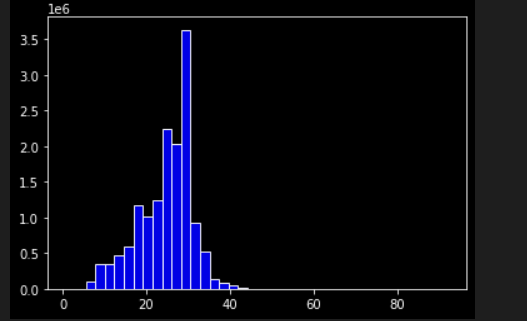

<!--
 * @Author: LawsonAbs
 * @Date: 2021-09-04 22:07:40
 * @LastEditTime: 2021-09-26 15:51:35
 * @FilePath: /daguan_gitee/data/README.md
-->
# 0. 环境要求
执行本代码的环境要求如下：
- 安装包版本
torch                              1.8.1
tqdm                               4.61.0
transformers                       4.7.0
visdom                             0.1.8.9
python                             3.8.3
pandas                             1.0.5
- 显卡
GeForce RTX 2080Ti * 2
对应Nvidia驱动 Driver Version: 455.45.01，CUDA Version: 11.1 。使用如上配置，应可在机器上顺利执行。


# 1. 算法思想
针对本赛题，LModel队伍将其视作一种**分类任务**，采取的方法是：使用基于**预训练+微调** 的方法来解决本任务。

# 2 任务分析
## 2.1 标签映射
将每个标签映射到一个独立的id，如将'5-24'映射到0，这样便构成了一个标签到id的唯一映射。这样就将任务转换成一个分类任务。

## 2.2 数据分析
数据分析主要围绕“文本长度”，“类别数据”进行分析。
针对文本长度，主要分析 `train.txt+test.txt` (+表示拼接两个文本)； `datagrand_2021_unlabeled_data` （下称无标签数据）中 `title` 字段数据长度，二者长度分布如下：



可以很明显看到，二者在文本长度这一特征上有明显的不同，所以让我们选择以无标签数据简单预训练，以 `train.txt + test.txt` 为主要预训练。

## 2.3 模型分析
处理分类任务的方法有很多，机器学习方法有：KNN算法；朴素贝叶斯；SVM等等。深度学习方法有：使用预训练模型+softmax分类。考虑到深度学习在分类问题上的优越表现，我们选择使用深度学习方法作为本问题的解决方案。在深度学习中我们使用的是 `chinese-roberta-wwm-ext-large` 。

## 2.4 模型融合
考虑到单模型在一个问题上可能存在短板，我们选择使用四个比较健壮的模型来融合得到最后的结果，即submission_ensemble.csv；同时考虑到小类别数据在上述四个模型上的效果不佳，我们采取重采样+数据增强的方法针对少数类别的样本进行一个单独的训练，将得到的模型进行一个融合，得到融合结果submission_less_ensemble.csv。在小样本数据（基于对train.txt数据的分析，将标签为 '3-5','8-27','6-20','7-16','8-18','9-23','10-26','5-24' 视作少样本的类别 ，后文的小样本统指此类数据）上，使用submission_less_ensembel.csv覆盖上述文件 submission_ensemble.csv 得到最后的提交文件 submission_best_combine.csv。


# 3. 详细实现
## 3.1 预训练
- step1. 使用无标签数据进行一个简单的预训练操作，训练1w step，得到模型checkpoint_1w
- step2. 在上述模型的基础上使用 `train.txt+test.txt`数据进行一个 90000 step 的预训练，得到预训练的最终模型 checkpoint_1w_9w

本部分使用的参数详见代码 ./code/pretrain/pretrain.py 中的参数。

## 3.2 微调
- step1. 使用预训练好的模型checkpoint_1w_9w 使用 `train.txt` 数据集进行微调。微调取 `epoch=10` 作为最后的微调结果模型，即 checkpoint_1w_9w_epoch_10。


## 3.3 预测

使用上面预训练得到的模型进行预测，预测结果写入到 submission.csv 中。

# 4. 代码结构
代码结构如下：
```c
|-- Image
    --README.md  # 详细说明docker镜像在百度云中的地址
|-- data
    |-- user_data
	    |-- 参赛者模型文件
	    |-- 其他文件等
    |-- prediction_result
        |--less  (对少数样本的预测结果)
        |--normal(对所有样本的预测结果)
	    |--result.txt （最后的提交结果）
    |-- code
	    |-- 这里是docker执行时需要的代码
    |-- raw_data
        |-- 比赛的数据集文件（这里执行时会被替换为官方网站上的数据）
    |--README.md
```

# 5. 其它
## 5.1 预训练说明
- 因为时间原因，LModel团队的预训练是在2.4G无标签数据+4.8M（train.txt+test.txt）上进行的，而没有使用单独的（train.txt+test.txt）进行预训练，不知道其效果如何，但按照常理，即使只有4.8M的数据，MLM任务的预训练也应该做的很好。

- 同时，本团队只做了一个token的mask，其实还可以做ngram 的mask操作，但同样由于比赛时间过于紧张，此部分实验也未能如期进行。有关ngram mask 在预训练方面的操作可以参考百度团队工作 ERNIE-Gram [https://aclanthology.org/2021.naacl-main.136/]，其对模型效果会有进一步的提升。

- 本团队使用了两个预训练词表，分别是user_data/data下的vocab_1.txt 和 vocab_2.txt，设计这两个词表的出发点分别在于：考虑词频（我们保留出现次数大于5的词）和与bert原生词表（靠近2.1w）保持一致。但是限于时间，我们尚未对词表大小最优设置进行判断，所以可能存在一种最优但我们尚未发现的词表设置。


## 5.2 文件命名说明
这里对文件命名进行一个解释说明。


## 5.3 ！！重要说明！！
由于团队疏忽，未能保存所有模型，导致部分数据无法重现，其包括如下文件：
- submission_0905_0.583.csv ： 一个较好的提交结果，于2021/09/05 23:40 提交A榜的成绩
- submission_balance_10_num_30.csv ：用于解决小样本问题。对于每个类别的数据只随机抽取30个样本，训练 10 epoch，得到的结果。
- submission_balance_10_num_60.csv ：用于解决小样本问题。对于每个类别的数据值随机抽取60个样本，训练 10 epoch，得到的结果。

如果需要完全复现团队B榜提交结果，还请按照run.sh脚本将文件 data/code/submission_0905_0.583.csv 移动到 data/prediction_result/normal 下，将 data/code/submission_balance_10_num_30.csv 和 data/code/submission_balance_10_num_60.csv 移动到 prediction_result/less 下，这样可保证**完全复现**提交结果。

# 方案二
考虑到贵司若坚持需要使用完全的预测模型重跑，则可以按照我在 run.sh 中的脚本中的说明进行相应操作。使用D_0.583_replace 模型生成近似于
submission_0905_0.583.csv 的结果； 使用D_60_replace,D_90_replace（因为仅使用30个样本训练模型，太少且不合适。所以后续使用了60、90个样本） 来代替生成 submission_balance_10_num_30.csv 和 submission_balance_10_num_60.csv。 
本方案肯定不能保证能够完全复现，但是存在比B榜提交结果好的可能（因为训练得到的D_60_replace，以及 D_90_replace 模型使用了较好的预训练模型微调得到）。

# 6. 复现操作
